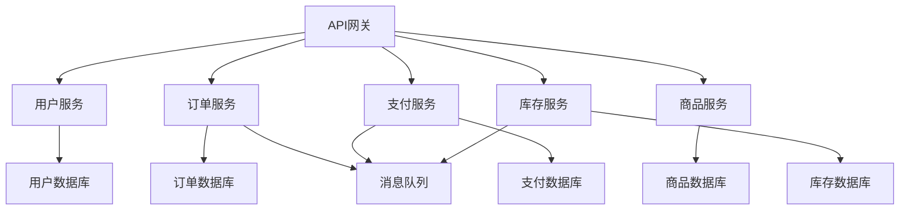
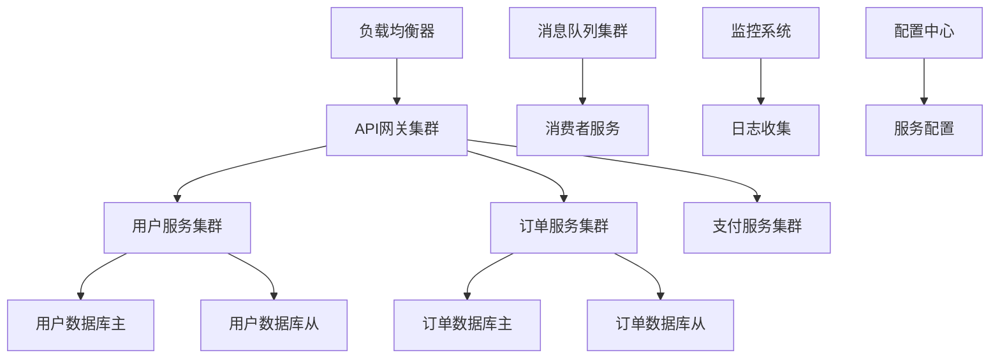

# 微服务架构设计Prompt模板

## 概述
本模板用于基于具体业务需求设计微服务架构，包括服务拆分、通信机制、数据管理、部署运维等各个方面。

## 使用场景
- 单体应用向微服务迁移
- 新项目微服务架构设计
- 微服务架构优化和重构
- 云原生应用架构设计

## Prompt模板

```
# 微服务架构设计Prompt

请基于以下需求设计微服务架构：

## 业务需求
[在此处描述业务需求和功能模块]

## 设计要求

### 1. 服务拆分策略
- 基于业务领域进行服务拆分
- 定义服务边界和职责
- 设计服务间的依赖关系

### 2. 通信机制设计
- 设计服务间通信协议
- 选择消息队列和事件驱动架构
- 设计API网关和路由策略

### 3. 数据管理设计
- 设计数据分片和存储策略
- 定义数据一致性和事务处理
- 设计数据同步和备份方案

### 4. 部署和运维设计
- 设计容器化和编排方案
- 定义监控和日志策略
- 设计CI/CD和自动化部署

### 5. 安全设计
- 设计服务间认证和授权
- 定义API安全和数据保护
- 设计网络安全和访问控制

### 6. 扩展性设计
- 设计水平扩展和负载均衡
- 定义服务发现和配置管理
- 设计故障恢复和容错机制

## 输出要求

请提供：
1. 微服务架构图
2. 服务拆分矩阵
3. 数据流和依赖关系图
4. 部署架构图
5. API设计规范
6. 监控和运维方案
7. 迁移策略和风险控制

## 技术约束
[在此处描述技术栈、基础设施、团队能力等约束]
```

## 设计要求详解

### 1. 服务拆分策略
**目标**: 将单体应用拆分为合适的微服务
**原则**:
- **单一职责**: 每个服务只负责一个业务领域
- **高内聚低耦合**: 服务内部高内聚，服务间低耦合
- **业务边界**: 基于业务领域边界进行拆分
- **团队边界**: 考虑团队组织结构和能力

**拆分方法**:
- **领域驱动设计(DDD)**: 基于业务领域进行拆分
- **功能拆分**: 基于功能模块进行拆分
- **数据拆分**: 基于数据实体进行拆分
- **团队拆分**: 基于团队组织进行拆分

**服务粒度**:
- **粗粒度**: 服务数量少，职责较多
- **细粒度**: 服务数量多，职责单一
- **适中粒度**: 平衡服务数量和职责复杂度

### 2. 通信机制设计
**目标**: 设计高效、可靠的服务间通信机制
**通信模式**:
- **同步通信**: HTTP/REST、gRPC、WebSocket
- **异步通信**: 消息队列、事件总线、发布订阅
- **混合通信**: 同步+异步的组合使用

**API设计**:
- **RESTful API**: 遵循REST设计原则
- **GraphQL**: 灵活的查询语言
- **gRPC**: 高性能的RPC框架
- **WebSocket**: 实时双向通信

**消息队列**:
- **RabbitMQ**: 功能丰富的消息队列
- **Apache Kafka**: 高吞吐量的流处理平台
- **Redis**: 轻量级的消息队列
- **Apache Pulsar**: 云原生消息平台

### 3. 数据管理设计
**目标**: 设计合理的数据存储和管理策略
**数据策略**:
- **数据库 per 服务**: 每个服务独立数据库
- **共享数据库**: 多个服务共享数据库
- **混合策略**: 核心服务独立，非核心服务共享

**数据一致性**:
- **强一致性**: ACID事务保证
- **最终一致性**: BASE理论，最终一致性
- **因果一致性**: 保证因果关系的顺序

**数据同步**:
- **事件驱动**: 通过事件进行数据同步
- **定时同步**: 定时任务进行数据同步
- **实时同步**: 实时数据同步机制

### 4. 部署和运维设计
**目标**: 设计自动化、可扩展的部署运维体系
**容器化**:
- **Docker**: 应用容器化
- **容器镜像**: 标准化部署单元
- **镜像仓库**: 镜像存储和管理

**编排管理**:
- **Kubernetes**: 容器编排平台
- **Docker Swarm**: Docker原生编排
- **OpenShift**: 企业级容器平台

**CI/CD**:
- **持续集成**: 代码提交自动构建测试
- **持续部署**: 自动部署到生产环境
- **蓝绿部署**: 零停机部署策略
- **金丝雀发布**: 灰度发布策略

### 5. 安全设计
**目标**: 确保微服务架构的安全性
**认证授权**:
- **JWT**: 无状态认证
- **OAuth2**: 授权框架
- **OIDC**: 身份认证协议
- **RBAC**: 基于角色的访问控制

**API安全**:
- **API网关**: 统一的安全入口
- **限流**: 防止API滥用
- **熔断**: 防止服务雪崩
- **加密**: 数据传输加密

**网络安全**:
- **服务网格**: Istio、Linkerd
- **网络策略**: 网络访问控制
- **TLS**: 传输层安全
- **VPN**: 虚拟专用网络

### 6. 扩展性设计
**目标**: 确保系统能够水平扩展
**负载均衡**:
- **应用层**: Nginx、HAProxy
- **网络层**: LVS、F5
- **服务层**: 客户端负载均衡
- **云原生**: 云服务商负载均衡

**服务发现**:
- **服务注册**: 服务自动注册
- **服务发现**: 服务自动发现
- **健康检查**: 服务健康状态检查
- **配置管理**: 动态配置管理

**故障恢复**:
- **熔断器**: 防止服务雪崩
- **重试机制**: 自动重试失败请求
- **降级策略**: 服务降级处理
- **故障转移**: 自动故障转移

## 输出格式建议

### 1. 微服务架构图


### 2. 服务拆分矩阵
| 服务名称 | 业务领域 | 职责范围 | 数据实体 | 团队负责 |
|----------|----------|----------|----------|----------|
| 用户服务 | 用户管理 | 用户注册、登录、信息管理 | User, Profile | 用户团队 |
| 订单服务 | 订单管理 | 订单创建、状态管理 | Order, OrderItem | 订单团队 |
| 支付服务 | 支付处理 | 支付处理、退款 | Payment, Transaction | 支付团队 |
| 商品服务 | 商品管理 | 商品信息、分类管理 | Product, Category | 商品团队 |
| 库存服务 | 库存管理 | 库存查询、扣减 | Inventory, Stock | 库存团队 |

### 3. 数据流图


### 4. 部署架构图


## 设计原则

### 1. 微服务原则
- **单一职责**: 每个服务只负责一个业务功能
- **独立部署**: 服务可以独立部署和升级
- **技术多样性**: 不同服务可以使用不同技术栈
- **数据隔离**: 每个服务管理自己的数据

### 2. 架构原则
- **松耦合**: 服务间通过接口通信，减少依赖
- **高内聚**: 服务内部功能紧密相关
- **可扩展**: 支持水平扩展和垂直扩展
- **可维护**: 便于维护和演进

### 3. 设计模式
- **API网关模式**: 统一入口和路由
- **服务发现模式**: 动态服务注册和发现
- **熔断器模式**: 防止服务雪崩
- **事件驱动模式**: 异步事件处理

## 技术选型

### 1. 开发框架
- **Spring Boot**: Java微服务框架
- **Node.js**: JavaScript运行时
- **Go**: 高性能编程语言
- **Python**: 快速开发语言

### 2. 数据存储
- **关系型数据库**: MySQL、PostgreSQL
- **NoSQL数据库**: MongoDB、Redis
- **时序数据库**: InfluxDB、Prometheus
- **搜索引擎**: Elasticsearch

### 3. 消息队列
- **RabbitMQ**: 功能丰富的消息队列
- **Apache Kafka**: 高吞吐量流处理
- **Redis**: 轻量级消息队列
- **Apache Pulsar**: 云原生消息平台

### 4. 容器和编排
- **Docker**: 容器化技术
- **Kubernetes**: 容器编排平台
- **Helm**: Kubernetes包管理
- **Istio**: 服务网格

## 实施策略

### 1. 迁移策略
- **Strangler Fig模式**: 逐步替换单体应用
- **数据库优先**: 先拆分数据库，再拆分服务
- **功能优先**: 先拆分核心功能
- **团队优先**: 基于团队能力进行拆分

### 2. 实施阶段
- **第一阶段**: 基础设施搭建
- **第二阶段**: 核心服务拆分
- **第三阶段**: 非核心服务拆分
- **第四阶段**: 优化和调优

### 3. 风险控制
- **渐进式迁移**: 逐步迁移，降低风险
- **回滚机制**: 建立快速回滚机制
- **监控告警**: 完善的监控和告警体系
- **测试验证**: 充分的测试和验证

## 监控和运维

### 1. 监控体系
- **应用监控**: 应用性能监控
- **基础设施监控**: 服务器、网络监控
- **业务监控**: 业务指标监控
- **日志监控**: 日志收集和分析

### 2. 运维工具
- **Prometheus**: 监控系统
- **Grafana**: 可视化面板
- **ELK Stack**: 日志分析
- **Jaeger**: 分布式追踪

### 3. 告警机制
- **多级告警**: 不同级别的告警策略
- **自动恢复**: 自动故障恢复机制
- **人工介入**: 需要人工处理的告警
- **升级机制**: 告警升级流程

## 最佳实践

### 1. 服务设计
- **API设计**: 遵循RESTful设计原则
- **版本管理**: API版本控制策略
- **文档管理**: API文档自动生成
- **测试策略**: 单元测试、集成测试

### 2. 数据管理
- **数据一致性**: 最终一致性策略
- **数据迁移**: 数据迁移和同步
- **备份恢复**: 数据备份和恢复策略
- **数据安全**: 数据加密和访问控制

### 3. 部署运维
- **自动化部署**: CI/CD流水线
- **环境管理**: 多环境管理策略
- **配置管理**: 配置中心和管理
- **故障处理**: 故障诊断和处理流程

## 使用技巧

1. **业务驱动**: 基于业务需求进行服务拆分

2. **团队协作**: 考虑团队组织结构和能力

3. **技术选型**: 选择成熟稳定的技术栈

4. **渐进实施**: 采用渐进式迁移策略

5. **持续优化**: 持续监控和优化系统性能

## 常见问题

### Q: 如何确定服务拆分的粒度？
A: 服务拆分粒度考虑因素：
- 业务复杂度和内聚性
- 团队组织结构和能力
- 技术栈和开发效率
- 运维复杂度和成本

### Q: 如何处理服务间的数据一致性？
A: 数据一致性处理策略：
- 使用分布式事务（如Saga模式）
- 采用最终一致性策略
- 通过事件驱动进行数据同步
- 使用补偿机制处理不一致

### Q: 如何保证微服务的性能？
A: 性能优化策略：
- 使用缓存减少数据库访问
- 采用异步处理提高响应速度
- 实施负载均衡分散压力
- 优化网络通信和序列化 