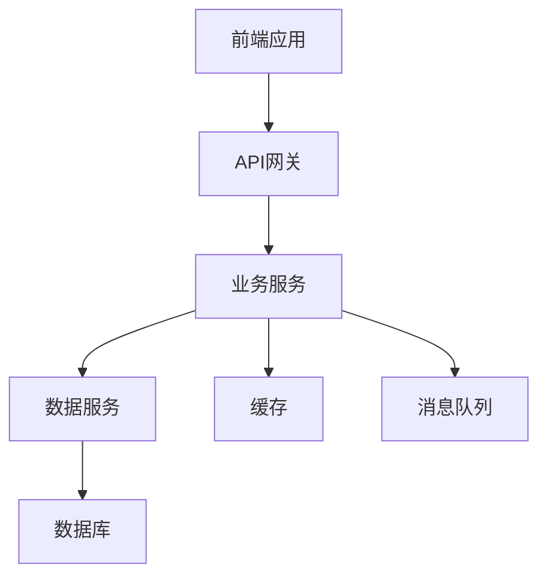
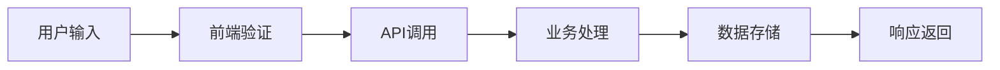
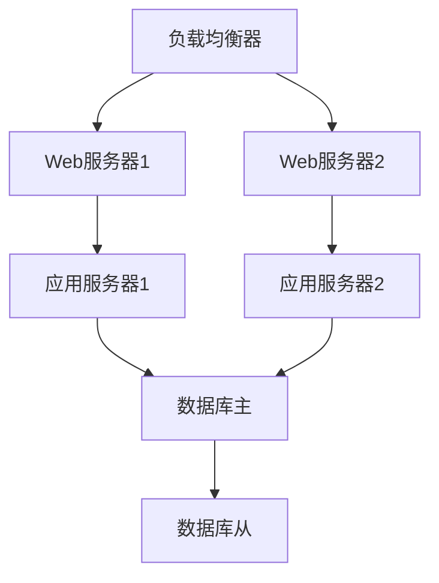

# 技术方案设计Prompt模板

## 概述
本模板用于基于具体需求设计完整的技术方案，包括系统架构、技术选型、数据流设计等各个方面。

## 使用场景
- 新项目技术方案设计
- 系统升级和重构方案
- 技术选型决策
- 架构设计评审

## Prompt模板

```
# 技术方案设计Prompt

基于以下需求，请设计一个完整的技术方案：

## 需求分析
[在此处描述具体需求]

## 设计要求

### 1. 系统架构设计
- 设计分层架构，明确各层职责
- 定义核心组件和模块
- 设计组件间的交互接口

### 2. 技术栈选择
- 前端技术栈（框架、UI库、状态管理等）
- 后端技术栈（语言、框架、数据库等）
- 基础设施和部署方案

### 3. 数据流设计
- 设计数据流向和处理流程
- 定义数据结构和接口规范
- 设计缓存和存储策略

### 4. 扩展性设计
- 设计插件和扩展机制
- 定义配置和定制化方案
- 设计多租户和版本管理

### 5. 性能优化设计
- 设计缓存策略和并发控制
- 优化资源使用和响应时间
- 设计监控和性能分析

### 6. 安全设计
- 设计认证和授权机制
- 定义数据安全和隐私保护
- 设计安全审计和日志

## 输出要求

请提供：
1. 系统架构图
2. 技术栈清单和选型理由
3. 核心组件设计
4. 数据流图
5. 部署架构图
6. 开发计划和里程碑
7. 风险评估和应对策略

## 约束条件
[在此处描述技术约束、预算限制、时间要求等]
```

## 设计要求详解

### 1. 系统架构设计
**目标**: 设计清晰、可维护的系统架构
**要点**:
- **分层设计**: 应用层、服务层、数据层等
- **模块化**: 高内聚、低耦合的模块设计
- **接口设计**: 清晰的API和组件接口
- **依赖管理**: 合理的依赖关系和注入机制

### 2. 技术栈选择
**目标**: 选择合适、成熟、可维护的技术栈
**考虑因素**:
- **团队技能**: 团队的技术能力和学习成本
- **项目需求**: 性能、扩展性、安全性要求
- **生态支持**: 社区活跃度和第三方库支持
- **长期维护**: 技术栈的稳定性和更新频率

### 3. 数据流设计
**目标**: 设计高效、可靠的数据处理流程
**要点**:
- **数据流向**: 清晰的数据流转路径
- **数据结构**: 合理的数据模型设计
- **缓存策略**: 多级缓存和缓存失效策略
- **存储方案**: 数据库选型和分片策略

### 4. 扩展性设计
**目标**: 确保系统能够灵活扩展和定制
**要点**:
- **插件架构**: 支持功能扩展的插件机制
- **配置管理**: 灵活的配置和参数管理
- **多租户**: 支持多租户的架构设计
- **版本管理**: API版本控制和向后兼容

### 5. 性能优化设计
**目标**: 确保系统具有良好的性能表现
**要点**:
- **缓存设计**: 多级缓存和缓存策略
- **并发控制**: 异步处理和并发限制
- **资源优化**: 内存、CPU、网络资源优化
- **监控体系**: 性能监控和告警机制

### 6. 安全设计
**目标**: 确保系统的安全性和数据保护
**要点**:
- **认证授权**: 多因子认证和细粒度授权
- **数据安全**: 数据加密和隐私保护
- **网络安全**: 网络安全防护和访问控制
- **审计日志**: 安全审计和操作日志

## 输出格式建议

### 1. 系统架构图


### 2. 技术栈清单
| 层级 | 技术选型 | 版本 | 选型理由 |
|------|----------|------|----------|
| 前端 | React | 18.x | 生态丰富，团队熟悉 |
| 后端 | Node.js | 18.x | 高性能，开发效率高 |
| 数据库 | PostgreSQL | 15.x | 功能强大，可靠性高 |

### 3. 数据流图


### 4. 部署架构图


## 设计原则

### 1. 架构原则
- **单一职责**: 每个组件只负责一个功能
- **开闭原则**: 对扩展开放，对修改关闭
- **依赖倒置**: 依赖抽象而非具体实现
- **接口隔离**: 使用多个专门接口而非单一接口

### 2. 设计模式
- **分层模式**: 清晰的层次结构
- **MVC模式**: 模型-视图-控制器分离
- **工厂模式**: 对象创建的统一管理
- **观察者模式**: 事件驱动的松耦合设计

### 3. 最佳实践
- **RESTful API**: 遵循REST设计原则
- **微服务**: 服务拆分和独立部署
- **容器化**: Docker容器化部署
- **CI/CD**: 持续集成和部署

## 风险评估

### 1. 技术风险
- **技术成熟度**: 新技术的学习成本和稳定性
- **团队能力**: 团队对新技术的掌握程度
- **生态支持**: 第三方库和工具的支持情况

### 2. 业务风险
- **需求变更**: 需求变更对架构的影响
- **性能要求**: 性能指标是否能够满足
- **扩展需求**: 未来扩展的可行性

### 3. 运营风险
- **维护成本**: 系统的长期维护成本
- **监控能力**: 系统监控和问题排查能力
- **备份恢复**: 数据备份和灾难恢复

## 实施计划

### 1. 开发阶段
- **第一阶段**: 核心功能开发
- **第二阶段**: 扩展功能开发
- **第三阶段**: 性能优化和测试
- **第四阶段**: 部署和上线

### 2. 里程碑
- **M1**: 基础架构搭建完成
- **M2**: 核心功能开发完成
- **M3**: 集成测试通过
- **M4**: 生产环境部署完成

### 3. 质量保证
- **代码审查**: 严格的代码审查流程
- **自动化测试**: 单元测试、集成测试、端到端测试
- **性能测试**: 负载测试和压力测试
- **安全测试**: 安全漏洞扫描和渗透测试

## 使用技巧

1. **需求分析**: 深入理解业务需求，确保技术方案与业务目标一致

2. **技术调研**: 充分调研相关技术，了解其优缺点和适用场景

3. **原型验证**: 通过原型验证技术方案的可行性

4. **团队沟通**: 与团队充分沟通，确保方案的可行性

5. **持续优化**: 根据实施过程中的反馈持续优化方案

## 常见问题

### Q: 如何平衡技术先进性和稳定性？
A: 建议采用渐进式技术升级策略：
- 核心组件使用成熟稳定的技术
- 非核心功能可以尝试新技术
- 建立技术评估和回退机制

### Q: 如何评估技术方案的成本？
A: 成本评估应包括：
- 开发成本（人力、时间）
- 基础设施成本（服务器、存储、网络）
- 运维成本（监控、维护、升级）
- 培训成本（团队技能提升）

### Q: 如何处理技术债务？
A: 技术债务管理策略：
- 定期评估和识别技术债务
- 制定技术债务偿还计划
- 在开发过程中避免产生新的技术债务
- 建立代码质量标准和审查机制 