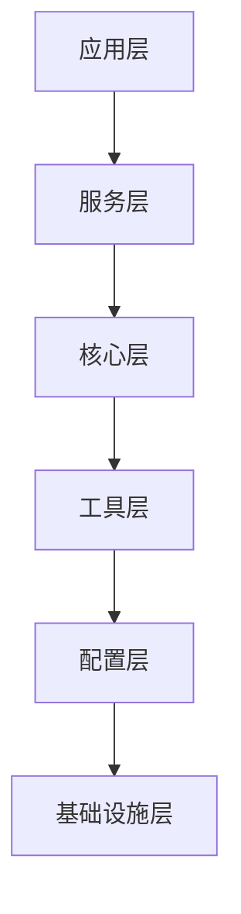
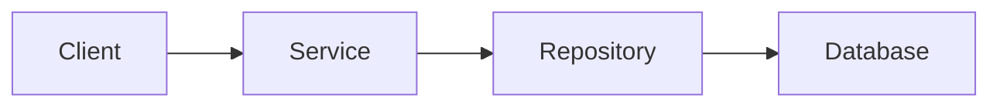
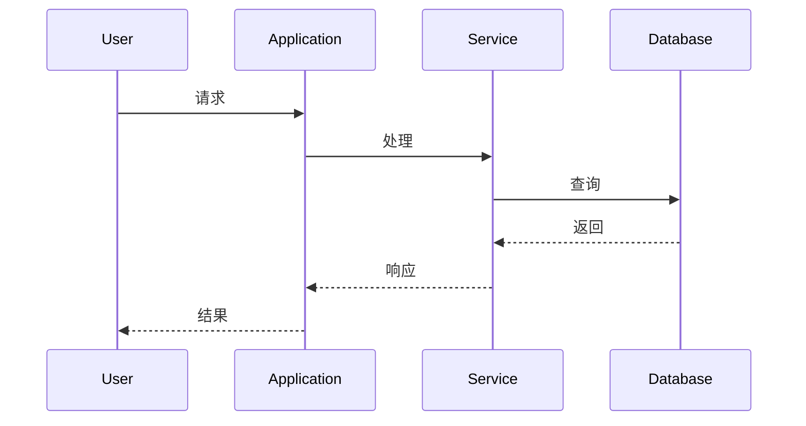

# 系统架构分析Prompt模板

## 概述
本模板用于对项目进行系统化的架构分析，从多个维度深入分析系统架构的合理性、可扩展性和性能表现。

## 使用场景
- 新项目架构设计评审
- 现有系统架构优化
- 技术选型决策支持
- 系统重构方案制定

## Prompt模板

```
# 系统架构深度分析Prompt

请对以下项目进行系统化的架构分析，从以下维度进行详细分析：

## 分析维度

### 1. 架构层次分析
- 识别项目的分层架构（如应用层、服务层、核心层、工具层、配置层、基础设施层）
- 分析各层的职责和边界
- 评估层间耦合度和依赖关系

### 2. 核心组件分析
- 识别核心业务组件和关键类
- 分析组件的职责和功能定位
- 评估组件的设计模式和架构原则

### 3. 数据流分析
- 分析主要业务流程和数据流向
- 识别关键的数据转换和处理节点
- 评估数据流的效率和瓶颈

### 4. 扩展性设计分析
- 分析系统的扩展机制和插件架构
- 评估新功能集成的便利性
- 识别扩展点和接口设计

### 5. 性能优化策略
- 分析性能优化措施（缓存、并发、流式处理等）
- 评估资源使用和内存管理
- 识别性能瓶颈和优化机会

### 6. 安全机制分析
- 分析安全防护措施和验证机制
- 评估数据安全和访问控制
- 识别潜在的安全风险

### 7. 错误处理和恢复
- 分析错误处理策略和重试机制
- 评估系统的容错能力
- 识别异常处理的最佳实践

## 输出要求

请提供：
1. 架构层次图（ASCII或Mermaid格式）
2. 核心组件关系图
3. 主要业务流程时序图
4. 详细的架构分析报告
5. 改进建议和最佳实践总结

## 项目信息
[在此处粘贴项目代码或描述]
```

## 分析维度详解

### 1. 架构层次分析
**目标**: 理解系统的整体结构和分层设计
**关注点**:
- 分层是否清晰，职责是否明确
- 层间依赖是否合理，是否存在循环依赖
- 是否遵循单一职责原则和依赖倒置原则

### 2. 核心组件分析
**目标**: 识别和理解关键业务组件
**关注点**:
- 组件的内聚性和耦合度
- 设计模式的应用是否恰当
- 组件的可测试性和可维护性

### 3. 数据流分析
**目标**: 理解数据在系统中的流动和处理
**关注点**:
- 数据流向是否清晰合理
- 是否存在数据瓶颈或冗余处理
- 数据一致性和完整性保障

### 4. 扩展性设计分析
**目标**: 评估系统的可扩展能力
**关注点**:
- 是否支持水平扩展和垂直扩展
- 新功能集成的便利性
- 插件和扩展机制的设计

### 5. 性能优化策略
**目标**: 评估系统的性能表现和优化措施
**关注点**:
- 缓存策略的设计和实施
- 并发处理和资源管理
- 性能监控和调优机制

### 6. 安全机制分析
**目标**: 评估系统的安全防护能力
**关注点**:
- 认证和授权机制
- 数据加密和隐私保护
- 安全审计和日志记录

### 7. 错误处理和恢复
**目标**: 评估系统的容错和恢复能力
**关注点**:
- 错误检测和处理机制
- 重试和回退策略
- 故障恢复和业务连续性

## 输出格式建议

### 1. 架构层次图


### 2. 核心组件关系图


### 3. 业务流程时序图


## 使用技巧

1. **项目信息准备**: 在分析前，确保提供完整的项目信息，包括代码结构、技术栈、业务需求等

2. **重点关注**: 根据项目特点，重点关注相关的分析维度，不必面面俱到

3. **对比分析**: 可以与同类项目或最佳实践进行对比分析

4. **持续改进**: 将分析结果作为持续改进的依据，定期回顾和更新

## 常见问题

### Q: 如何确定分析的重点？
A: 根据项目的阶段和需求确定重点：
- 新项目：重点关注架构设计和扩展性
- 成熟项目：重点关注性能优化和重构
- 问题项目：重点关注错误处理和安全性

### Q: 分析结果如何应用？
A: 分析结果可以用于：
- 指导后续的开发工作
- 制定重构和优化计划
- 技术选型和架构决策
- 团队培训和知识分享 